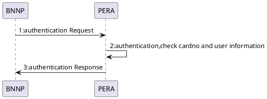
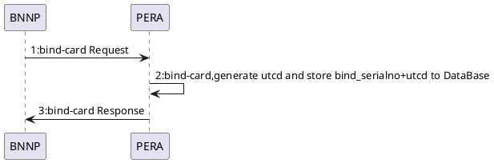
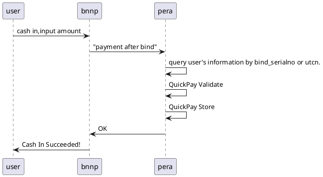
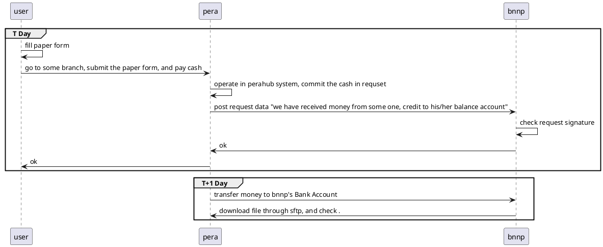

# 6.1.2.1

```plantuml
@startuml
BNNP->PERA: 1:authentication Request
PERA->PERA: 2:authentication,check cardno and user information 
BNNP<-PERA: 3:authentication Response
@end
```

# 6.1.2.2

```plantuml
@startuml
BNNP->PERA: 1:bind-card Request
PERA->PERA: 2:bind-card,generate utcd and store bind_serialno+utcd to DataBase
BNNP<-PERA: 3:bind-card Response
@end
```

# 6.2.2

```plantuml
@startuml
user->bnnp: cash in,input amount
bnnp->pera: "payment after bind"
pera->pera: query user's information by bind_serialno or utcn.
pera->pera: QuickPay Validate
pera->pera: QuickPay Store
pera->bnnp: OK
bnnp->user: Cash In Succeeded!
@end
```

#  6.7.2

```plantuml
@startuml
group T Day
user -> user : fill paper form
user -> pera : go to some branch, submit the paper form, and pay cash
pera -> pera : operate in perahub system, commit the cash in requset
pera -> bnnp : post request data "we have received money from some one, credit to his/her balance account"
bnnp -> bnnp : check request signature
bnnp -> pera : ok
pera -> user : ok
end
group T+1 Day
pera -> bnnp : transfer money to bnnp's Bank Account
bnnp -> pera : download file through sftp, and check .
end
@end
```