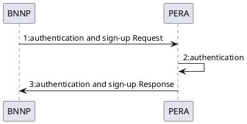
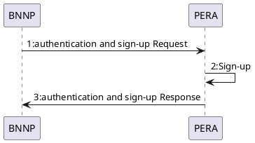

# 6.1.2.1

```plantuml
@startuml
BNNP->PERA: 1:authentication and sign-up Request
PERA->PERA: 2:authentication
BNNP<-PERA: 3:authentication and sign-up Response
@end
```

# 6.1.2.2

```plantuml
@startuml
BNNP->PERA: 1:authentication and sign-up Request
PERA->PERA: 2:Sign-up
BNNP<-PERA: 3:authentication and sign-up Response
@end
```